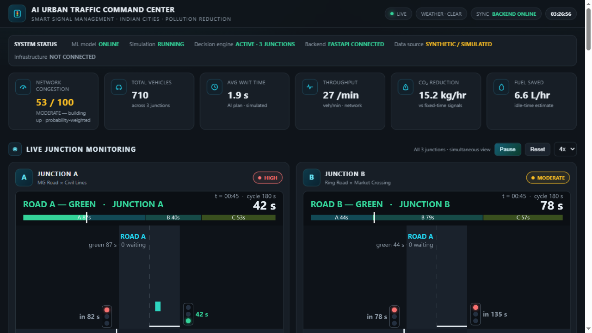
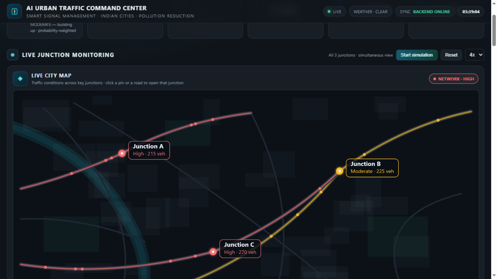
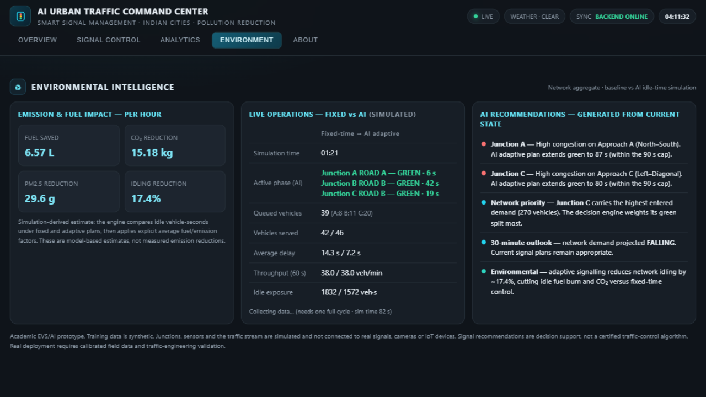

# 🚦 AI Urban Traffic Command Center

### AI-assisted traffic intelligence for congestion-aware signal planning and environmental analysis

**An academic decision-support prototype combining machine learning, traffic simulation, adaptive signal optimization, demand forecasting, and environmental intelligence in one urban traffic operations dashboard.**

 

 

### 🌐 [Live Command Center](https://ai-urban-traffic-command-center.onrender.com/) · 💻 [Source Code](https://github.com/devanshshukla-3004/AI-Urban-Traffic-Command-Center)

---

## 🎯 Project Overview

Urban traffic congestion is more than a transportation problem. Repeated queuing, waiting and inefficient signal allocation can increase travel delay and contribute to fuel use and vehicle-related environmental impact.

**AI Urban Traffic Command Center** explores how machine learning and simulation can support a more proactive traffic-management workflow.

Instead of presenting a static traffic dashboard, the system creates a digital-twin-style simulation environment where predicted traffic demand is converted into signal recommendations and evaluated against a fixed-time baseline.

> **Core idea:** Observe → Predict → Decide → Simulate → Measure → Explain

This is an **academic decision-support prototype**. It is not connected to real traffic infrastructure and does not claim certified real-world emission reductions.

---

## 🖥️ Command Center Preview

| Command Center | Live City Network |
|:---:|:---:|
|  |  |

| Environmental Intelligence |
|:---:|
|  |

---

## ✨ What Makes This Project Different

Many student traffic projects stop at **congestion prediction**.

This project extends the workflow beyond prediction:

**Prediction → Optimization → Simulation → Environmental Interpretation**

The result is a complete decision-support pipeline that demonstrates how an ML prediction can become an operational recommendation and how that recommendation can be evaluated inside a controlled simulation.

### Key capabilities

- 🗺️ **Multi-junction command center** — monitor three simulated urban junctions from one interface.
- 🤖 **ML congestion intelligence** — Random Forest classification estimates Low / Moderate / High congestion with class probabilities.
- 🚦 **Adaptive signal planning** — converts predicted demand into bounded green-time recommendations.
- ⏱️ **Hard signal constraints** — every phase remains between **20–90 seconds**, with an **exact 180-second cycle**.
- 🧬 **Digital-twin-style simulation** — simulated arrivals, queues, signal states, vehicle movement and delay evolve dynamically.
- ⚖️ **Baseline vs AI comparison** — evaluates fixed-time and AI-assisted strategies under the same simulated traffic conditions.
- 📈 **Short-horizon demand forecasting** — a separate regression model estimates upcoming network demand.
- 🌱 **Environmental intelligence** — translates simulation-derived idle-time differences into model-based fuel, CO₂ and PM2.5 estimates.
- 📡 **Simulated sensor layer** — represents AQI, PM2.5 and weather intelligence derived from network state.
- 🎛️ **Bounded manual override** — operators can adjust signal timing without bypassing predefined constraints.

---

## 🧠 System Architecture

    SIMULATED URBAN TRAFFIC INPUTS
    Junctions • Vehicle Demand • Time • Day • Weather • Sensors
                            │
                            ▼
                  DATA / FEATURE LAYER
              Validation • Encoding • Preparation
                            │
              ┌─────────────┴─────────────┐
              ▼                           ▼
       ML CONGESTION MODEL        DEMAND FORECASTER
       Random Forest              Short-horizon prediction
              │                           │
              └─────────────┬─────────────┘
                            ▼
                 ADAPTIVE SIGNAL OPTIMIZER
                 20–90 s bounds • 180 s cycle
                            │
                            ▼
                    TRAFFIC SIMULATION
             Fixed-Time vs AI-Assisted Plan
             Queues • Delay • Flow • Idle Time
                            │
                            ▼
                 ENVIRONMENTAL INTELLIGENCE
                 Fuel • CO₂ • PM2.5 estimates
                            │
                            ▼
                    COMMAND CENTER UI
            Map • Junctions • Signals • Forecast

---

## 🔄 Decision Pipeline

    Traffic conditions
          ↓
    Feature preparation
          ↓
    Random Forest congestion prediction
          ↓
    Demand estimation / forecasting
          ↓
    Adaptive signal optimization
          ↓
    20–90 s bounded phases
          ↓
    Exact 180 s cycle
          ↓
    Discrete-event traffic simulation
          ↓
    Fixed-time vs AI-assisted comparison
          ↓
    Idle-time / queue analysis
          ↓
    Environmental impact estimation
          ↓
    Command-center visualization

---

## 🤖 Machine Learning

### 1. Congestion Classification

The system uses a **Random Forest classifier** to estimate congestion conditions from traffic-related features such as:

- Hour
- Day / day type
- Weather condition
- Junction / road context
- Simulated vehicle demand

Output classes:

**LOW · MODERATE · HIGH**

The dashboard also exposes prediction probabilities to make the model output more interpretable.

### 2. Demand Forecasting

A separate regression component estimates short-term traffic demand to support proactive decision-making rather than relying only on the current traffic state.

---

## 🚦 Adaptive Signal Optimization

The optimizer transforms predicted demand into signal recommendations while enforcing explicit operational constraints:

| Constraint | Value |
|---|---:|
| Minimum green | **20 seconds** |
| Maximum green | **90 seconds** |
| Total cycle | **180 seconds** |

The optimizer therefore does not simply choose an unconstrained mathematical optimum. It produces a recommendation inside the predefined signal-control envelope.

---

## 🧪 Traffic Simulation

The command center contains a **digital-twin-style simulation layer** that models:

- Vehicle arrivals
- Queues
- Signal states
- Vehicle movement
- Green/red transitions
- Waiting and idle time
- Traffic throughput
- Fixed-time vs AI-assisted strategies

Both strategies can be evaluated under the same simulated traffic conditions, creating a controlled environment for studying signal-management decisions.

### Why simulation?

Real traffic infrastructure cannot safely be used as an experimental playground.

Simulation provides a reproducible environment for testing decision logic before any hypothetical field deployment.

---

## 🌱 Environmental Intelligence

The project connects traffic operations with environmental analysis.

The simulation tracks traffic-related quantities such as **idle time**, which can then be translated into model-based estimates for:

- Fuel consumption
- CO₂ emissions
- PM2.5-related impact

### Important distinction

These are **simulation-derived estimates**, not direct measurements from roadside emission sensors.

The analytical chain is:

**Traffic delay / idle time → Estimated fuel use → Estimated emissions → Environmental interpretation**

---

## 📊 Command Center Modules

| Module | Purpose |
|---|---|
| 🗺️ City Map | Visualize the simulated traffic network |
| 🚦 Junction Control | Inspect individual junction conditions |
| 🤖 AI Prediction | View congestion class and probabilities |
| ⏱️ Signal Control | Inspect adaptive signal timing |
| 🧪 Simulation | Compare traffic-management strategies |
| 📈 Forecasting | View upcoming demand estimates |
| 📡 Sensors | Monitor simulated environmental signals |
| 🌱 Environment | Interpret model-based environmental impact |
| 🎛️ Manual Override | Apply bounded operator adjustments |

---

## 🛠️ Technology Stack

| Layer | Technologies |
|---|---|
| Language | Python, JavaScript |
| Machine Learning | scikit-learn |
| ML Models | Random Forest Classifier, Demand Regression |
| Data Processing | Pandas, NumPy |
| Backend | FastAPI, Uvicorn |
| Frontend | HTML, CSS, Vanilla JavaScript |
| Visualization | Canvas-based digital-twin visualizations |
| Simulation | Discrete-event / queue-based traffic simulation |
| Model Persistence | Joblib |
| Deployment | Render |
| Data | Synthetic / simulated benchmark data |

---

## 📐 Engineering Design Principles

### 1. Constraint-aware AI

The ML model does not directly control infrastructure. Predictions pass through a bounded decision layer before producing signal recommendations.

### 2. Simulation before deployment

Potential strategies are evaluated in simulation rather than being presented as real-world traffic-control instructions.

### 3. Explainability

The dashboard exposes the major decision stages:

**Prediction → Demand → Signal Recommendation → Simulation → Environmental Interpretation**

### 4. Reproducibility

The simulation and synthetic-data pipeline are designed so experiments can be repeated under controlled conditions.

### 5. Honest uncertainty

Synthetic data, simulated traffic and model-based environmental estimates are explicitly separated from real-world measurements.

---

## 🚀 Run Locally

### 1. Clone

    git clone https://github.com/devanshshukla-3004/AI-Urban-Traffic-Command-Center.git
    cd AI-Urban-Traffic-Command-Center

### 2. Install dependencies

    pip install -r requirements.txt

### 3. Train / refresh models

    python train_model.py

Trained artifacts are already included, so retraining is optional for a basic run.

### 4. Start the backend

    uvicorn server:app --reload --port 8000

### 5. Open

    http://127.0.0.1:8000

### Windows

Use the included **run_dashboard.bat** launcher.

---

## 🔌 API

### Health Check

    GET /api/health

Returns backend and model availability information.

### Traffic Decision Service

    GET /api/decision

The decision service provides the information required by the dashboard, including prediction, signal recommendations, forecasting, simulated sensor intelligence and environmental estimates.

---

## 🧩 Project Structure

    AI-Urban-Traffic-Command-Center/
    │
    ├── dashboard.html
    ├── server.py
    ├── train_model.py
    │
    ├── models/
    │   ├── *.joblib
    │   └── metrics / metadata
    │
    ├── data/
    │   └── *.csv
    │
    ├── docs/
    │   └── screenshots/
    │
    ├── requirements.txt
    ├── render.yaml
    ├── Procfile
    ├── run_dashboard.bat
    └── PROJECT_STRUCTURE.md

---

## ⚠️ Scope, Limitations & Responsible AI

This project is intentionally presented as an **academic prototype**.

### The system does NOT:

- Control real traffic signals
- Access real CCTV feeds
- Connect to municipal traffic infrastructure
- Provide regulatory or engineering certification
- Guarantee real-world emission reductions
- Treat simulated environmental estimates as measured emissions

### Main limitations

**Synthetic training data**  
The ML pipeline is demonstrated using synthetic/simulated traffic data rather than calibrated city-scale traffic data.

**Simulation assumptions**  
Real traffic includes complex driver behaviour, lane changes, incidents, pedestrians, public transport, road geometry and many other factors not fully represented here.

**Environmental model assumptions**  
Fuel and emission calculations depend on simplified modelling factors and simulation-derived idle time.

**Real-world deployment requirements**  
A production system would require field-calibrated data, validated traffic models, sensor integration, traffic-engineering review, cybersecurity controls, safety validation and appropriate municipal authorization.

---

## 🔬 Future Scope

The architecture can be extended toward a more realistic intelligent transportation system through:

- 📹 Computer-vision vehicle detection from CCTV
- 📡 Real-time traffic sensor / IoT integration
- 🗺️ GIS-based road-network modelling
- 🌦️ Real-time weather integration
- 🧠 Deep-learning traffic forecasting
- 🧬 Graph Neural Networks for network-level prediction
- 🌱 More detailed emissions modelling
- 🚨 Real-time incident detection
- 🔐 Cybersecurity monitoring for intelligent transportation infrastructure
- 👥 Multi-agent traffic simulation
- 🏙️ City-scale digital twins
- 📊 Integration with validated historical traffic datasets

---

## 🎓 Academic Context

**Project:** AI-Driven Smart Urban Traffic Management System for Reducing Environmental Pollution in Indian Cities

**Course:** Environmental Studies — CA1

**Institution:** Lovely Professional University

**Project Team:**

- **Devansh Shukla**
- **Janhwi Kundansingh Gaharwar**
- **Laxman Singh Dagar**

---

## 🌐 Project Links

| Resource | Link |
|---|---|
| 🌐 Live Demo | https://ai-urban-traffic-command-center.onrender.com/ |
| 💻 GitHub | https://github.com/devanshshukla-3004/AI-Urban-Traffic-Command-Center |
| 🎥 Project Video | Add final video link |
| 📄 Project Report | Add final report link |

---

## 👨‍💻 Author

### Devansh Shukla

**B.Tech CSE · AI · Data Science · Cybersecurity**

Building practical systems at the intersection of **Artificial Intelligence, Data Science, Software Engineering and Cybersecurity**.

🔗 [LinkedIn](https://www.linkedin.com/in/devansh-shukla-22b7a7429/)

🔗 [GitHub](https://github.com/devanshshukla-3004)

---

### 🚦 From Traffic Data to Intelligent Decisions

**Observe · Predict · Optimize · Simulate · Measure**

⭐ If you find the project interesting, consider starring the repository.

